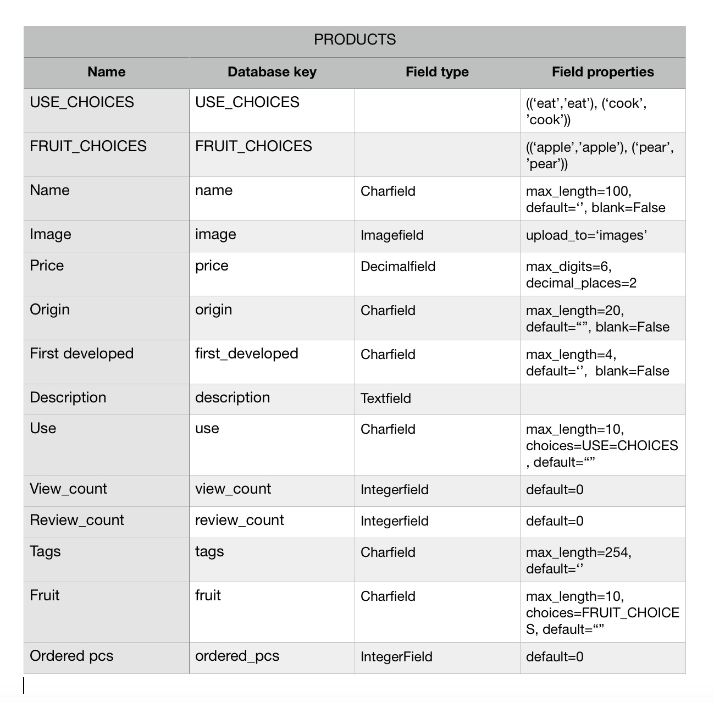
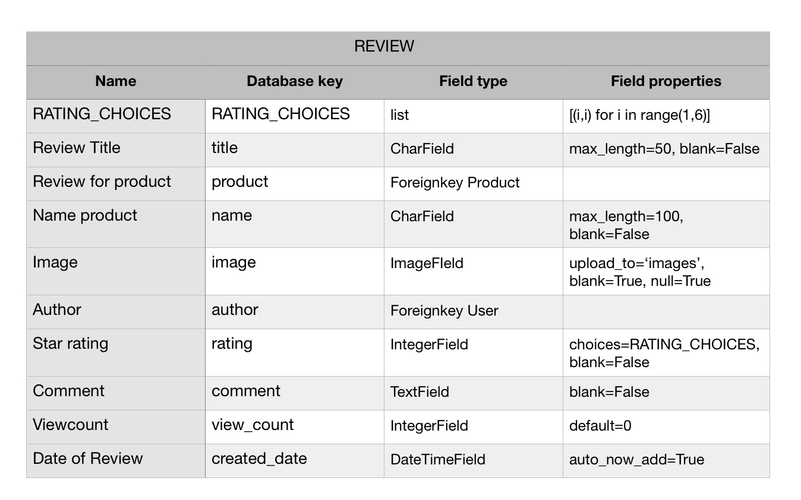
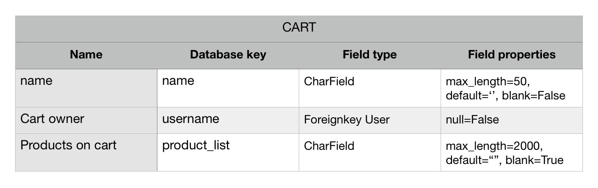
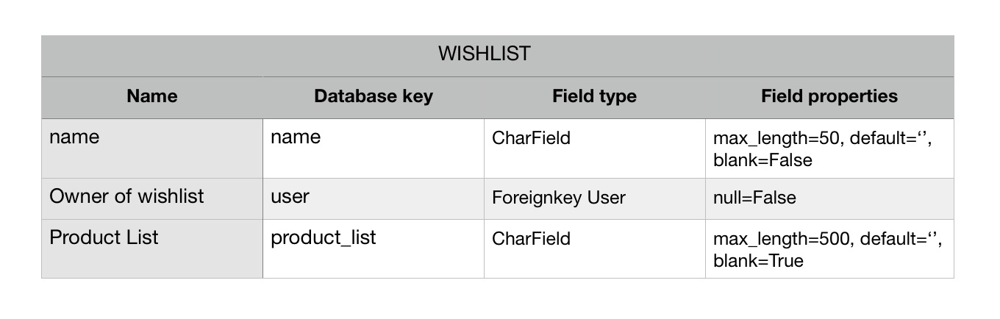
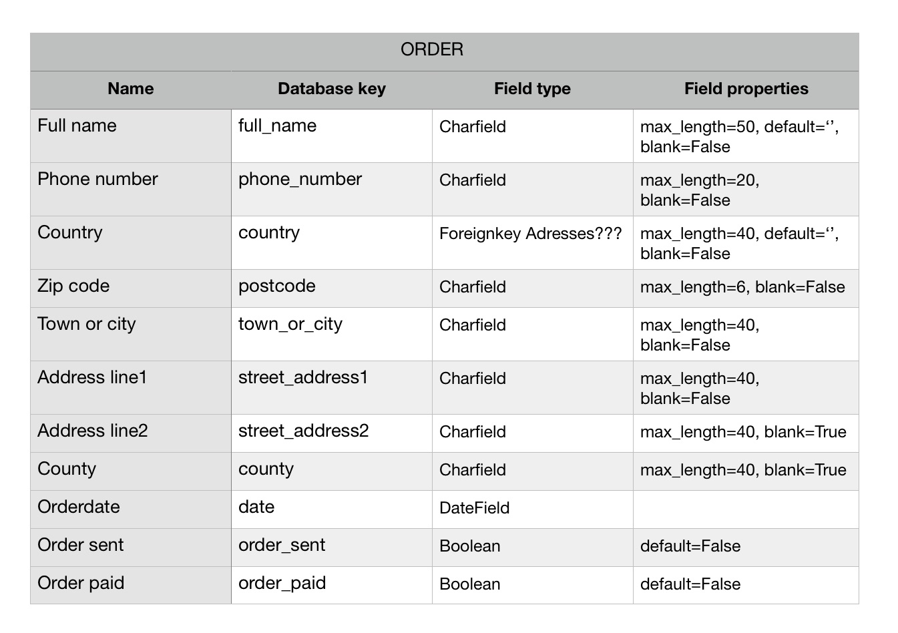
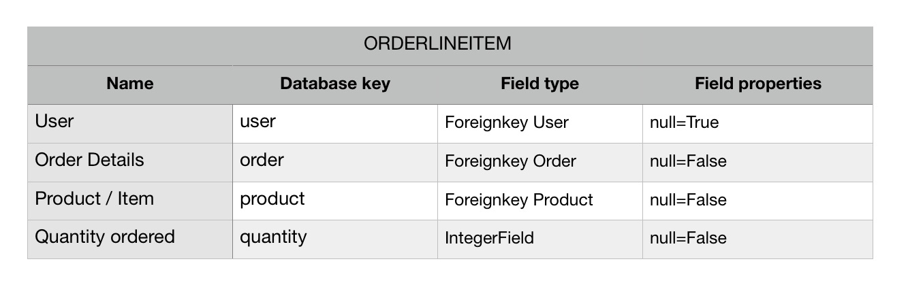
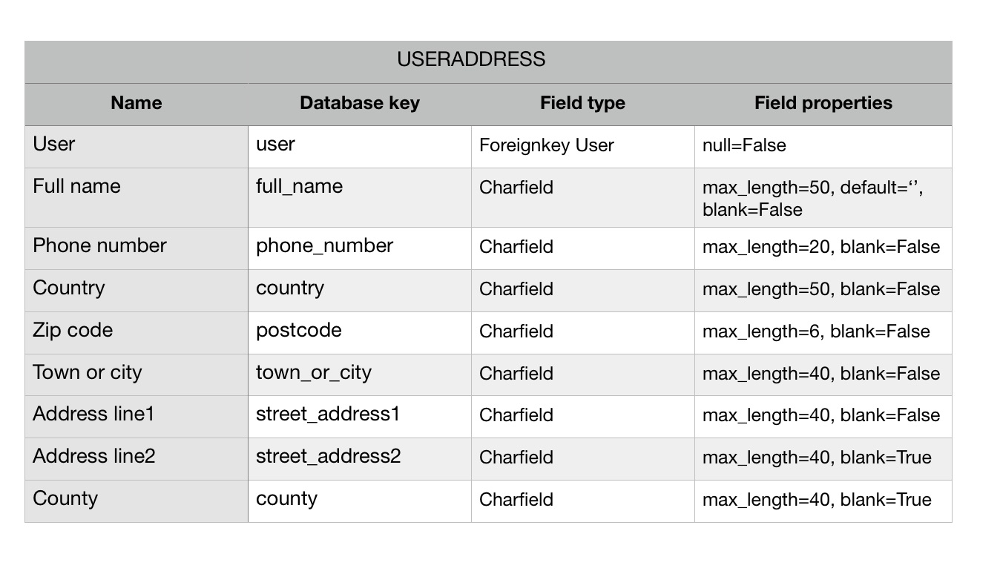
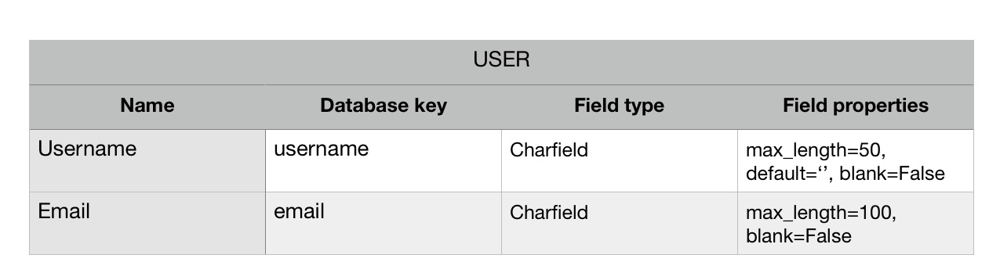
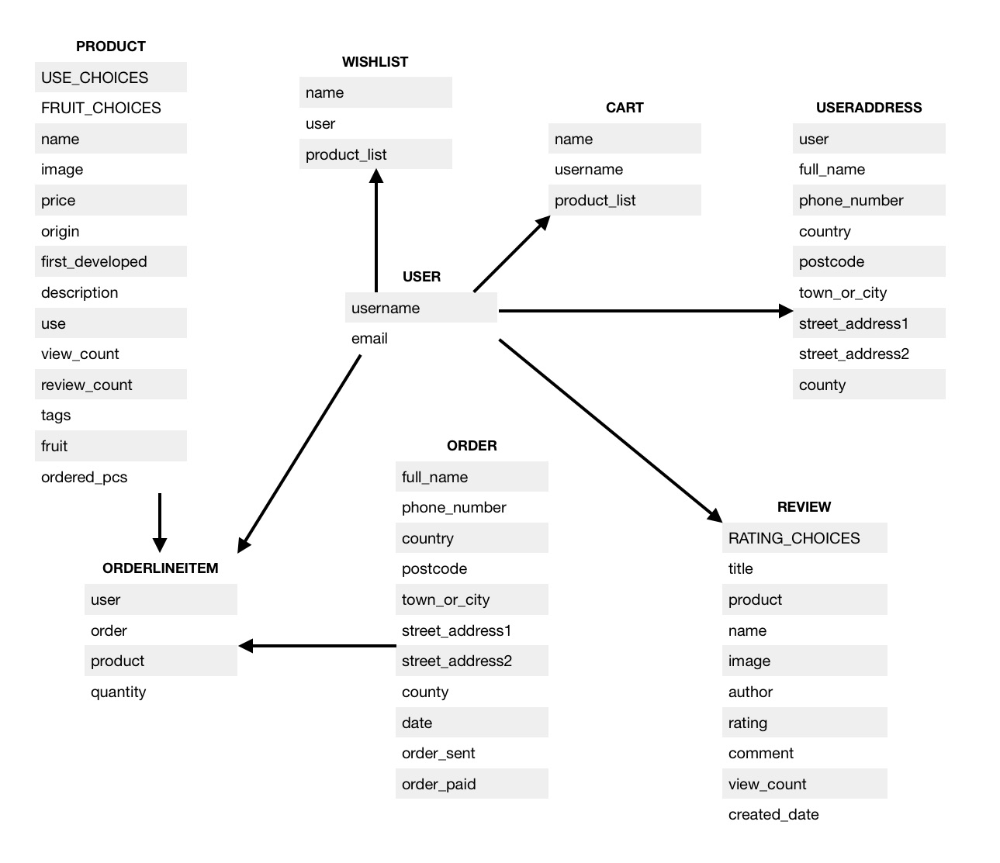
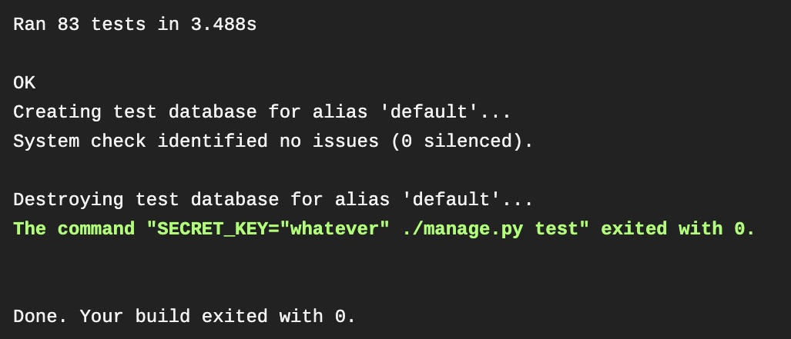

# Fullstack Django Milestone Project: The appleshop

LIVELINK: https://the-appleshop.herokuapp.com/products/
GITHUB: https://github.com/poldi2018/the_appleshop

The Django admin panel can be accessed with following credentials.

* login: admin
* password: Test12345

# Applications screen

# User stories / Requirements

* As a user I would like to have an overview of products this shop has to offer.
*  I want to be able to register an account and to logon on from desktop or mobile device, so I can store my favourites list of products and shopping cart for later review.
*  User preferences should list my user details and order history, User management
*  It should provide the possibility to review products I have purchased.
*  A search function should present products based on entered search term.
*  Should support credit cards for payment option.

# Shop features

* user management
* products search
* shopping cart functionality, registered users can save cart to database.
* checkout to finalise orders by paying with creditcard
* review function for purchased items
* maintain a wish list for registered users
* User created cart and wishlist saved in database are merged with a possibly locally created list before being logged in. For the shopping cart, if a product is in server cart and local cart, the higher value is set on merged cart.
* free shipping above 50 EUR

# APPS in this project

The Apps 'accounts', 'cart', 'checkout', 'products' and 'search' have been taken from course program.
I have added in total 4 models and one form as listed below.

* APP 'reviews'
* APP 'wishlist'
* APP 'cart' , 'Cart' model has been added to be able to save cart to database.
* APP 'accounts', 'UserAdress' model and form for user address has been added.

# Models and relational database schema

# Technologies used in this project

* HTML for browser presentation, https://www.w3.org/html/
* CSS with SCSS and BOOTSTRAP for styling the frontend.
* JAVASCRIPT for handling of form validation and DOM frontend
* JQUERY for manipulation of DOM elements, https://jquery.com
* PYTHON with DJANGO 1.11.29 is used for backend engine, https://www.python.org/
* JINJA2 used as templating language on HTML files.
* AWS for uploaded product and review images, https://aws.amazon.com
* HEROKU for deploying project to the web, https://heroku.com/
* FONTAWESOME for icons, https://fontawesome.com/
* BOOTSTRAP for using styles for forms and other elements.
* BALSAMIQ has been used for creation of wireframes, https://balsamiq.com/
* AUTOPREFIXER was used to get the CSS vendor codes, https://autoprefixer.github.io/
* YAML for converting back database dictionary-string into dictionary
* TRAVIS-CI for CI/CD testing
* GITHUB for code version handling

# Wireframes

* The wireframes can be accessed in this folder:

(https://github.com/poldi2018/the_appleshop/tree/master/static/data/mockups)

# Cloning the project

* Create a project in IDE and clone it by executing the bash command

git clone https://github.com/poldi2018/the_appleshop.git

* In working directory of that project please create a file (e.g. env.py) to host the env variables.
* The optional keys TESTING is only needed for testing to force Django to use sqlite. USELOCALSTATIC is used to work with local static files instead of AWS.

* The env.py file should only contain the environment variable, such as:

import os

os.environ.setdefault("DEBUG", "True")
os.environ.setdefault("TESTING", "True")
os.environ.setdefault("USELOCALSTATIC", "True")

os.environ.setdefault("SECRET_KEY", "YOUR-SECRET-KEY")
os.environ.setdefault("DATABASE_URL", "The URL provided by HEROKU")

os.environ.setdefault("STRIPE_PUBLISHABLE", "PROVIDED BY STRIPE")
os.environ.setdefault("STRIPE_SECRET", "YOUR STRIPE API KEY")
os.environ.setdefault("AWS_ACCESS_KEY_ID", "PROVIDED BY AWS")
os.environ.setdefault("AWS_SECRET_ACCESS_KEY", "PROVIDED BY AWS")

!! Please add the env.py file to .gitignore file !!

# Local Deployment

To run this project locally, the following steps need to be done:

# AWS S3 bucket creation

In S3 section:

* create an S3 bucket
The following Tabs need to checked for adaptation of settings

* Tab name and region:
- bucket name: Please provide a name for the bucket
- region: FRA

* Tab set permissions:
- unblock / uncheck all
- save bucket

* click on bucket name for extended setup

* Tab permissions: Unblock / uncheck all

* Tab bucket policy:

* With the help of the policy generator, generate :
- Type of policy: S3 bucket policy
- Principal: *
- Actions: GetObject
- ARN: arn:aws:s3:::the-appleshop/*
- generate bucket policy, the outcome should look like this:

{
  "Id": "Policy1593110443922",
  "Version": "2012-10-17",
  "Statement": [
    {
      "Sid": "Stmt1593110414089",
      "Action": [
        "s3:GetObject"
      ],
      "Effect": "Allow",
      "Resource": "arn:aws:s3:::the-appleshop/*",
      "Principal": "*"
    }
  ]
}

* save text to editor and save.

* Use this standard template for CORS configuration:

*  Tab CORS configuration:

<?xml version="1.0" encoding="UTF-8"?>
<CORSConfiguration xmlns="http://s3.amazonaws.com/doc/2006-03-01/">
<CORSRule>
    <AllowedOrigin>*</AllowedOrigin>
    <AllowedMethod>GET</AllowedMethod>
    <AllowedMethod>HEAD</AllowedMethod>
    <MaxAgeSeconds>3000</MaxAgeSeconds>
    <AllowedHeader>Authorization</AllowedHeader>
</CORSRule>
</CORSConfiguration>

* In IAM section:

- POLICIES
* create policy
* import managed policy
* search for AmazonS3FullAccess
* on JSON tab, replace value for 'Resource' key with a list:
* ["arn:aws:s3:::YOURBUCKETNAME", "arn:aws:s3:::YOURBUCKETNAME/*"]
* provide a name

- GROUPS
* create group
* provide name
* attach policy just created
* Save group

- USERS
* Choose username
* Programmatic access as access type
* check and add user to just created group
* Next, add tags: no keys
* Create user
* download csv file with credentials. Use the two keys as values in Heroku and env.py file

- CONFIG settings.py:

AWS_STORAGE_BUCKET_NAME = 'YOURBUCKETNAME'
AWS_S3_REGION_NAME = 'eu-west-1'
AWS_ACCESS_KEY_ID = os.environ.get("AWS_ACCESS_KEY_ID")
AWS_SECRET_ACCESS_KEY = os.environ.get("AWS_SECRET_ACCESS_KEY")
AWS_S3_CUSTOM_DOMAIN = '%s.s3.amazonaws.com' % AWS_STORAGE_BUCKET_NAME

When switching from local static files folder to AWS bucket,
remove this line:

STATIC_ROOT = os.path.join(BASE_DIR, 'staticfiles')

... and put this line into place:
STATICFILES_STORAGE = 'custom_storages.StaticStorage'

# Deployment on Heroku

In order to deploy this project to the web, please create an account at https://heroku.com/ and create an app with a unique name, region Europe. Write down the provided url for later call to run the project.

* Please setup a Dyno for Postgres DB in the dashboard to setup postgres DATABASE_URL

On settings tab, click on 'Reveal Config Vars' and add the following variables.

SECRET_KEY  A key of your choice
STRIPE_PUBLISHABLE  Publish key provided by Stripe.com
STRIPE_SECRET Your secret key provided by Stripe.com
IP = 0.0.0.0
PORT = 5000
AWS_ACCESS_KEY_ID  Provided after S3 bucket creation
AWS_SECRET_ACCESS_KEY Provided after S3 bucket creation

# Current issues

Technical issues are not present so far. But this shop site needs to have some better
graphical content and should be updated with future features to implement.

# Future features to implement

* Pagination to limit returned documents per query.
* Scroll markers, to jump to last position after added products to wishlist or shopping cart. I attempted to use some ajax query to avoid re-rendering after posting, but this did not work out very well.
* A filter settings dropdown to filter search results
* Email functionality for password reset and customer queries.
* For legal conformity, a GDPR statement for real shop environment would be mandatory.

# Acknowledgement

* Slack:

The slack community helped a lot to know where to start troubleshooting. The search function revealed much!

* Stackoverflow

This marvellous site was used to point me into the right direction when I didn't find a way to get rid of bugs.

### Beside from above mentioned acknowledgements NO other code has been copied.

# Compliance reports

* Compliance reports can be found in reports folder

(https://github.com/poldi2018/the_appleshop/tree/master/static/data/reports)

CSS PENDING
HTML PENDING
JShint PENDING
PEP8 PENDING

# Testing

* All methods have been tested by using Django Testkit.

## A detailed coverage report is available here:

(https://github.com/poldi2018/the_appleshop/tree/master/htmlcov)

* Testing with Travis CI has passed :)

## Manual Testing

* All the functionality was also tested by hand

It took a lot of reading, testing and thinking to go through this course. Sometimes it was hard, but it's beautiful! Thanks so much for the review!

Regards!

Peer
